</a><br/><br/>
<p align="center">NASTY is a practical framework for building composable data applications that are easy to maintain. Think type safety, beautiful abstractions, unit tests... everything an engineer expects in 2024.</p>

<sub>By [Cotera](https://cotera.co), inspired by [Ruby Koans](https://www.rubykoans.com/).</sub>

## 👋 Learn Nasty By Example

A simple repository to get you started with understanding the Nasty Analytics Toolkit, quickly.

## 💡 Who is this for? 

This is for people who have a little understanding of SQL but maybe not
familiarity with Typescript, unit tests, or advanced SQL constructs (windows,
aggregates, ...etc). After teaching the basics, the examples get progressively
more advanced and show of more powerful analytics tools.

Each example is run via unit tests, as a way to demonstrate the power you can leverage when you bring tests to your analytics code.

## ⚡️ Quickstart
Make sure you have NodeJS installed ([Download](https://nodejs.org/en/downloaddownload)).

:warning: **Installation can take a few minutes, due to downloading the duckdb binary**

```bash
$ git clone https://github.com/coterahq/learn-nasty-by-example.git

$ cd learn-nasty-by-example

$ npm i

$ npm run test
```
If this is all setup correctly, you should see an output similar to this:


### :heavy_check_mark: Running tests

All tests

```bash
$ npm run test
```

Running a single test

```bash
# npm run test -- <file name>
$ npm run test -- src/01_the-basics.test.ts
```

Running `.learn.ts` files

```bash
$ TEST_LEARN=true npm test
```

## ⚽ Goals 

By the end, you should have a reasonable understanding of how to use Nasty to perform analytics tasks on the example data.

### :eyes: But How?

Through test driven development! 🚦

In the practice of test-driven development, the guiding principle is often summarized as "red, green, refactor." This means first creating a test that fails upon execution (indicated by red), then adjusting the code until the test succeeds (signified by green), and finally examining and improving the code's structure or clarity (refactoring).

For thee examples, you will need to run the test and see it fail (red), make the test pass (green), then take a moment and reflect upon the test to see what it is teaching you and improve the code to better communicate its intent (refactor).

Normally the flow looks like this:

```mermaid
graph LR
    A[Run Test] --> B{Did It Fail?}
    B -->|yes| D[Edit]
    B -->|No| C{Needs Refactor?}
    D --> A
    C -->|Yes| D
    C -->|No| E[Profit 💰]
```




## :open_file_folder: How is this structured

### The `.learn.ts` files

each `.learn.ts` file contains examples of how to use the concept in nasty. Start in these files to see examples on how to use a concept

### The `.test.ts` files

These let you apply the skills you've learned in examples by fixing unit tests

```typescript
test.skip("I'm a description of the example", () => {
  // Example code here
});
```

In order to attempt an example remove the `.skip` like so

```typescript
test("I'm a description of the example", () => {
  // Example code here
});
```

## 🎯 Troubleshooting

### Make sure NodeJS is installed

```bash
$ node --version
```

If NodeJS is installed, you should see an output like 

```
v18.17.0
```

### Are your dependencies up to date?

Try running this to update your dependencies.
```bash
$ npm i
```

### Still Having issues?
Join our [Discord](https://discord.com/channels/1215021133003235360/1215021133594890252) and get in touch!

